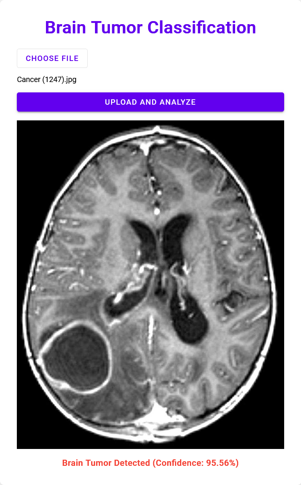

# Brain Tumor Classification

This project provides a Flask-based web application for classifying brain MRI images to detect the presence of tumors using machine learning.



## Important Note

Due to file size limitations on GitHub, the `brain_tumor_model.keras` file is not included in this repository. You will need to either train the model yourself using the provided notebook or download the pre-trained model separately.

## Getting Started

There are two ways to use this project: training the model yourself using the provided Jupyter notebook, or using the pre-trained model via Docker.

### Option 1: Training the Model

1. Clone this repository:
   ```
   git clone https://github.com/pouryare/brain-tumor-classification.git
   cd brain-tumor-classification
   ```

2. Download the dataset:
   - Visit [Brain Tumor Dataset on Kaggle](https://www.kaggle.com/datasets/preetviradiya/brian-tumor-dataset)
   - Download the dataset files

3. Open and run the `Brain_Tumor_Classification.ipynb` notebook:
   - This notebook contains the code to train the model
   - Follow the instructions within the notebook to train and save the model

4. After training, ensure the following file is in your project directory:
   - `brain_tumor_model.keras`

5. Install the required Python packages:
   ```
   pip install -r requirements.txt
   ```

6. Run the Flask application:
   ```
   python app.py
   ```

7. Open a web browser and navigate to `http://localhost:8080`

### Option 2: Using Docker

If you prefer to use the pre-trained model without going through the training process, you can use Docker:

1. Pull the Docker image:
   ```
   docker pull pouryare/brain-tumor-classification:latest
   ```

2. Run the Docker container:
   ```
   docker run -p 8080:8080 pouryare/brain-tumor-classification:latest
   ```

3. Open a web browser and navigate to `http://localhost:8080`

## Usage

Once the application is running:

1. You'll see an interface to upload a brain MRI image (JPG format only).
2. Click on "Choose File" to select an MRI image from your computer.
3. Click "Upload and Analyze" to process the image.
4. The application will display the prediction result: No Brain Tumor or Brain Tumor Detected, along with a confidence score.

## Project Structure

- `app.py`: Main Flask application containing both the web server and model logic
- `requirements.txt`: List of Python dependencies
- `Dockerfile`: Instructions for building the Docker image
- `templates/index.html`: HTML template for the web interface
- `Brain_Tumor_Classification.ipynb`: Jupyter notebook for model training
- `brain_tumor_model.keras`: Trained model file (not included in the repository)
- `static/uploads/`: Directory for temporarily storing uploaded images

## Acknowledgements

This project was inspired by and builds upon the work of others in the field of medical image analysis using deep learning. We acknowledge the contributions of the open-source community and the creators of the datasets and tools used in this project. Special thanks to Preet Viradiya for providing the dataset on Kaggle.

## Disclaimer

This project is for educational purposes only. While it aims to provide insights into brain tumor detection based on MRI images, it should not be used as a substitute for professional medical diagnosis or treatment. Always consult with a qualified healthcare provider for any health-related concerns.
